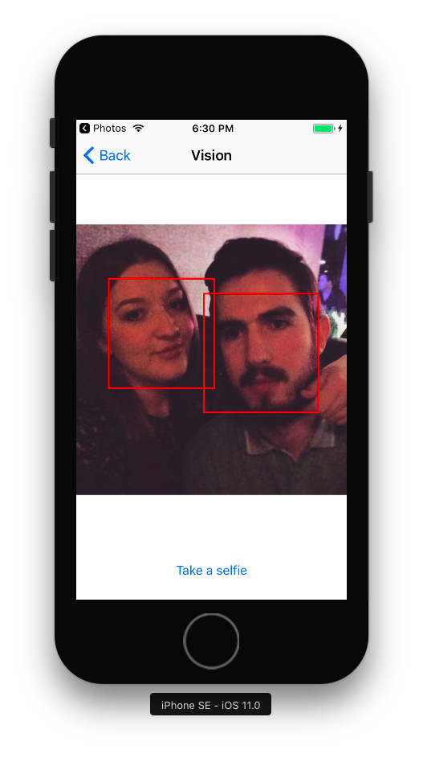
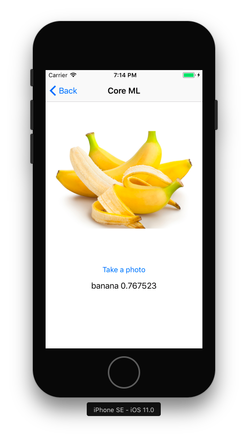

# iOS-11-Sampler

Code examples for new APIs of iOS 11.

## Contents

### Vision

Image recognition demo using Vision framework. Detects all faces on selected photo.

### Core ML

Image classification demo using Core ML framework. Show description of an object on selected photo.

### IdentityLookup

SMS and MMS filtering using IdentityLookup framework. Don't forget to turn on an extension in Messages > Unknown & Spam > SMS filtering.

### Core NFC

Reading of NFC tag payloads. Don't forget to enable NFC Tag Reading for App ID in the Apple Developer site.

### DeviceCheck

Identifying devices that have already taken advantage of a promotional offer that you provide, or flagging a device that you have determined to be fraudulent.

### ARKit

Augmented reality experiences in your app or game.
