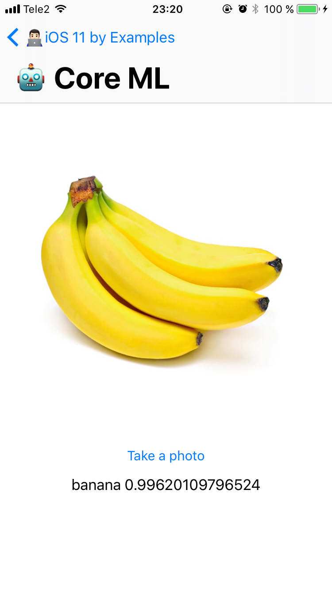
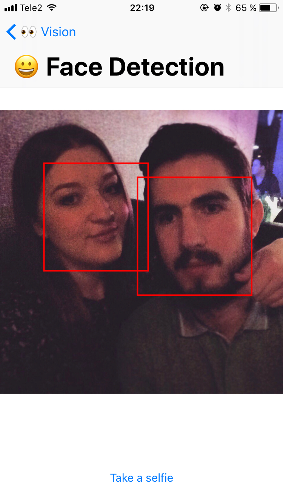
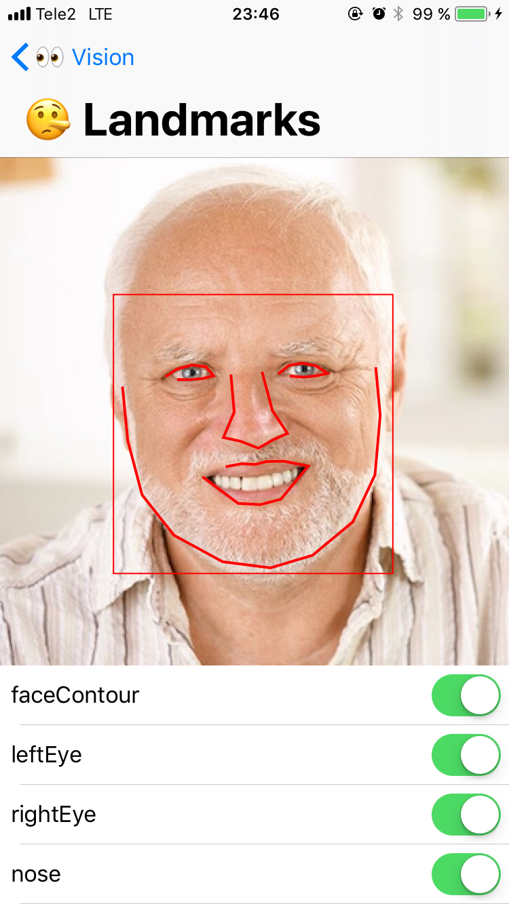
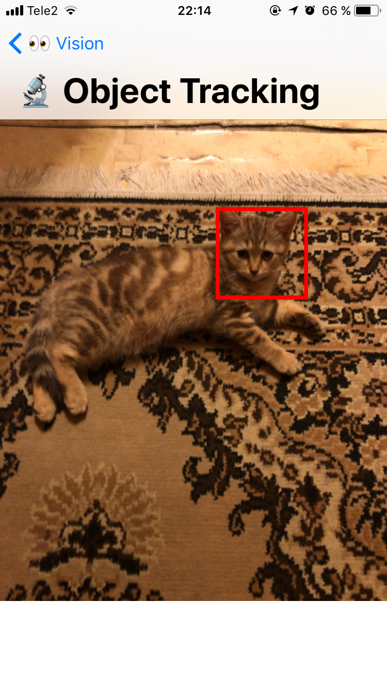
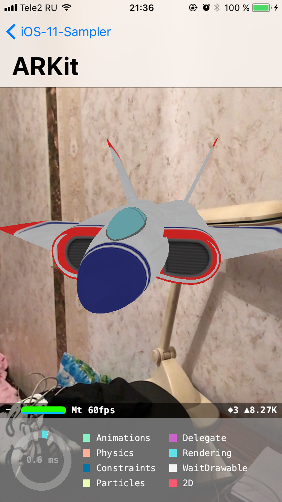
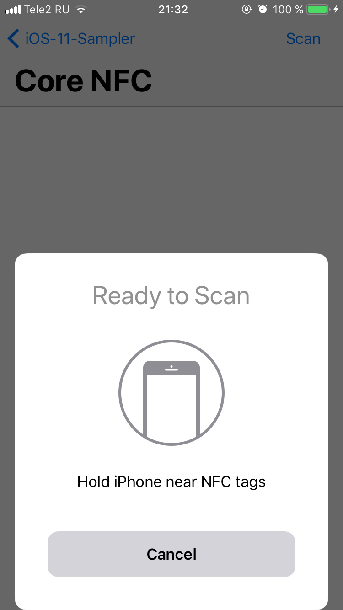
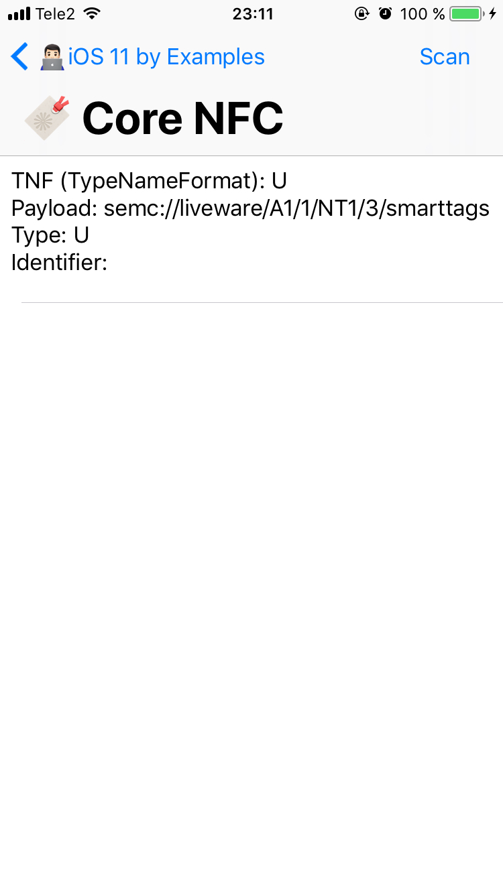
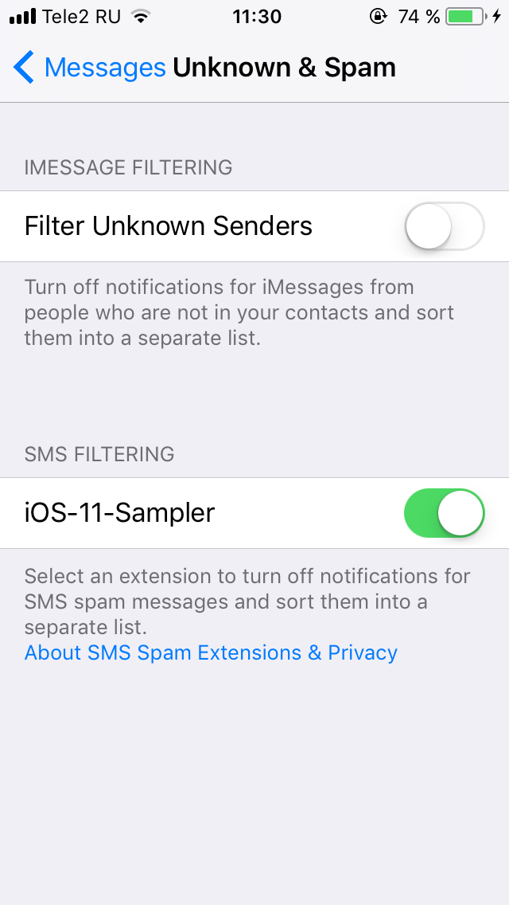

# iOS 11 by Examples
  

Code examples for new APIs of iOS 11.

**Note**: The project requires Xcode 9 Beta 1 or later, Swift 4 and iOS 11.

## Table of contents

- [Core ML](#core-ml)
- [Vision](#vision)
- [ARKit](#arkit)
- [Core NFC](#core-nfc)
- [IdentityLookup](#identitylookup)
- [DeviceCheck](#devicecheck)
- [Blogs/Newsletter](#blogsnewsletter)

### [Core ML](https://developer.apple.com/documentation/coreml)

Image classification demo using Core ML framework. Show description of an object on selected photo.

### [Vision](https://developer.apple.com/documentation/vision)

 - Face detection. Detects all faces on selected photo.

- Face landmarks. An image analysis that finds facial features (such as the eyes and mouth) in an image.

- Object tracking. Track any object using camera.

### [ARKit](https://developer.apple.com/documentation/arkit)

Augmented reality experiences in your app or game.

### [Core NFC](https://developer.apple.com/documentation/corenfc)

Reading of NFC tag payloads. Don't forget to enable NFC Tag Reading for App ID in the Apple Developer site. Since Xcode 9 beta 2 Core NFC can now be enabled via the Capabilities tab in Xcode.

**Note**: select CoreNFC-Example scheme and run.

 

### [IdentityLookup](https://developer.apple.com/documentation/identitylookup)

SMS and MMS filtering using IdentityLookup framework. Don't forget to turn on an extension in Messages > Unknown & Spam > SMS filtering.

### [DeviceCheck](https://developer.apple.com/documentation/devicecheck)

Identifying devices that have already taken advantage of a promotional offer that you provide, or flagging a device that you have determined to be fraudulent.

**Note**: select DeviceChecking scheme and run.

### Blogs/Newsletter
List of online sources which have mentioned iOS 11 by Examples: 

- [Digest MBLTDEV - issue #123](http://digest.mbltdev.ru/digests/146)
- [Natasha's This Week in Swift - issue #136](https://swiftnews.curated.co/issues/136#libraries)
- [Indie iOS Focus Weekly - issue #127](https://indieiosfocus.curated.co/issues/127?#resources)
- iOS Developers Slack Weekly Digest, June 28, 2017
- [iOS Cookies Newsletter - issue #83](http://mailchi.mp/e9fd17553d2e/ios-cookies-newsletter-1415405?e=c4238d2155)
- [iOSGoodies - issue #187](http://ios-goodies.com/post/162409261711/week-187)
- [iOS Dev Weekly - issue #307](https://iosdevweekly.com/issues/307?#code)

## Author

Artem Novichkov, novichkoff93@gmail.com

## License

iOS 11 by Examples is available under the MIT license. See the LICENSE file for more info.
